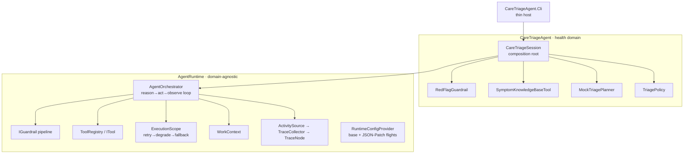

# mini-health-agent-runtime

A small, **runnable agent runtime** in C# / .NET 8 — a domain-agnostic orchestration core
(`AgentRuntime`) with a health **symptom-triage & care-navigation** agent (`CareTriageAgent`) built
on top. It reproduces, in miniature, the architecture of a production agent platform: a reason →
act → observe loop, config-driven execution with JSON-Patch flights, a failure / degradation
framework, a work-context store, safety guardrails, and OpenTelemetry tracing.

> ⚠️ **Educational only — not medical advice.** This is a teaching/example project. The triage
> agent is a navigation aid with a hard-coded emergency-escalation guardrail; it is not a diagnostic
> system. Do not use it for real medical decisions.

The default path is **fully offline and deterministic**: `dotnet run` works with **zero API keys**,
no network, and no database — all data is synthetic JSON in the repo.

---

## What it does

Type symptoms; the agent runs a multi-step triage turn and returns an **urgency level**
(`SelfCare` / `SeeGp` / `UrgentCare` / `Emergency`), a recommended action, the tools it used, a
not-medical-advice disclaimer — and a **trace tree** of the turn.

```
> dizziness and abdominal pain

Agent: Seek urgent care today. Sit or lie down... Note where the pain is and whether it worsens.

  ┌─ Triage ─────────────────────────────
  │ Urgency:     UrgentCare
  │ Action:      Seek urgent care today.
  │ Tools used:  symptom_kb
  │ Educational only — not medical advice.
  └──────────────────────────────────────

[trace]
  triage.turn  (2.40 ms)
    └ guardrail  (0.10 ms)
    └ agent.step  (1.10 ms)
      └ tool:symptom_kb  (0.40 ms)
    └ agent.step  (0.30 ms)
```

Three behaviours fall out of the architecture, all demonstrable live:

- **Red-flag escalation** — `chest pain + shortness of breath` short-circuits to an emergency message *before any planning*.
- **Graceful degradation** — a failing tool is retried, then the turn degrades to a safe answer instead of crashing (`⚠ degraded` in the trace).
- **Config-driven behaviour** — a JSON-Patch *flight* changes thresholds or disables a tool with **no recompile**.

---

## Architecture

`AgentRuntime` is **domain-agnostic** — it has zero health knowledge and could host any agent. All
health specifics live in `CareTriageAgent`. The CLI is a thin host; the web host (Milestone 2) will
reuse the exact same composition root.



One turn: `OnUserMessage` → **guardrail pipeline** (red-flag runs first, can short-circuit) →
**plan → act → observe loop** (planner picks the next step; tools run through `ExecutionScope`;
observations feed back) → **Finish** with a `TriageResult` → trace tree emitted.

> Full design notes — contracts, schemas, control flow, and the Milestone 2 plan — are in [DESIGN.md](DESIGN.md).

---

## How it was built — 12 TDD slices

Built test-first in vertical slices; each left the repo green and runnable. (Each row = one merged PR.)

| # | Slice | Contribution | Key types |
|---|-------|--------------|-----------|
| 1 | Orchestrator finish path | Core reason→act→observe loop skeleton | `AgentOrchestrator`, `WorkContext`, `ILlmClient`, `PlanDecision`, `TurnResult` |
| 2 | Act → observe loop | Tool framework + the real loop | `ITool`, `ToolRegistry`, `PlanDecision.CallTool`, observations |
| 3 | Red-flag guardrail | Pre-planning safety pipeline | `IGuardrail`, `GuardrailVerdict`, `RedFlagGuardrail` |
| 4 | Step budget | Bounded loop → safe degraded fallback (no infinite loop) | `MaxSteps` |
| 5 | Triage policy | Pure score → urgency mapping | `TriagePolicy`, `UrgencyLevel`, `TriageThresholds` |
| 6 | Triage brain | Real symptom scoring + planner + structured result | `SymptomKnowledgeBaseTool`, `MockTriagePlanner`, `TriageResult` |
| 7 | Failure framework | Unified retry / degrade / swallow + safe error messages | `ExecutionScope`, `ScopeResult<T>`, `CompliantException`, `FailureMode` |
| 8 | Degrade wiring | Tool calls run through the scope → live degradation | `WorkContext.Degraded` |
| 9 | Config engine | Base config + ordered JSON-Patch flight overlays (allow-listed) | `RuntimeConfigProvider` |
| 10 | Config wiring | Thresholds / retries / enabled tools from config + `--flight` | `CareTriageConfig` |
| 11 | Safety invariant | Composition root; **no flight can disable the guardrail** | `CareTriageSession` |
| 12 | Observability | Per-turn OpenTelemetry trace tree (latency + degraded tag) | `RuntimeActivitySource`, `TraceCollector`, `TraceNode` |

**35 unit + integration tests** pin every behaviour (xUnit + Moq).

---

## Concept → file map

The runtime mirrors the standard concerns of a production agent platform. Each one is a
self-contained, navigable piece of the codebase:

| Concept | Where it lives | What it does |
|---------|----------------|-------------|
| Agent orchestration | `AgentRuntime/Orchestration/AgentOrchestrator.cs` | Multi-step reason→act→observe loop (tool calls / decision loops) |
| Config-driven execution + flights | `AgentRuntime/Config/RuntimeConfigProvider.cs` | Base config + JSON-Patch flights — change behavior with no recompile |
| Failure / degradation framework | `AgentRuntime/Failure/` | `CompliantException` / `FailureMode` / degraded responses; retry→degrade→fallback |
| Work context store | `AgentRuntime/Context/WorkContext.cs` | Cross-turn state / memory; cacheable providers (Milestone 2) |
| Tool selection & invocation | `AgentRuntime/Tools/` | Tool registry + invocation strategy |
| Distributed tracing | `AgentRuntime/Observability/` | OpenTelemetry spans: agent steps, tool chains, latency breakdown |
| Safety invariant | `CareTriageAgent/Guardrails/RedFlagGuardrail.cs` + `CareTriageSession.cs` | A guardrail config/flights cannot override |

---

## Inputs & outputs

**Input** — free-text symptoms, plus optional flags:

| Flag | Effect |
|------|--------|
| `--flight <name>` | Apply an allow-listed JSON-Patch overlay (repeatable). Shipped: `strict-thresholds`, `disable-symptom-kb` |
| `--break-symptom-kb` | Force the symptom tool to fail (demonstrates retry → degrade → safe fallback) |

**Output** — the agent reply, a structured `TriageResult` (`urgency`, `recommendedAction`,
`toolsInvoked`, `degraded`, `disclaimer`), and the turn's trace tree.

---

## Quick start

**Prerequisite:** the .NET 8 SDK — nothing else.

```bash
dotnet build MiniHealthAgentRuntime.sln
dotnet test                                                                 # 35 passing

# Triage flows (all offline, deterministic)
dotnet run --project src/CareTriageAgent.Cli -- "sore throat and mild fever"           # SelfCare
dotnet run --project src/CareTriageAgent.Cli -- "dizziness and abdominal pain"         # UrgentCare
dotnet run --project src/CareTriageAgent.Cli -- "severe chest pain and shortness of breath"  # 🚨 red-flag

# Config-driven behaviour — same input, different outcome, no recompile
dotnet run --project src/CareTriageAgent.Cli -- --flight strict-thresholds "headache"  # SelfCare → SeeGp
dotnet run --project src/CareTriageAgent.Cli -- --flight disable-symptom-kb "sore throat"

# Graceful degradation
dotnet run --project src/CareTriageAgent.Cli -- --break-symptom-kb "sore throat"       # ⚠ degraded, no crash
```

---

## Milestone 2 — yes, a web app

Milestone 1 (above) is the **engine**: the whole runtime, proven offline, headless, with a CLI
surface. Milestone 2 turns it into a **browser app** that runs the same runtime server-side and
*visualizes* the trace tree.

Planned, in slices:

1. **`CareTriageAgent.Web`** — an ASP.NET Core minimal-API host. `POST /triage` drives the same
   `CareTriageSession`; `GET /` serves a self-contained `wwwroot/index.html` (vanilla HTML/JS, no
   build step). A `WebApplicationFactory` integration test covers the endpoint.
2. **Browser UI** — a chat pane (color-coded triage card + disclaimer) and a **trace pane** that
   renders the `TraceNode` tree as a collapsible tree / latency timeline, with red-flag and
   `degraded` spans highlighted. A small toolbar toggles flights and the broken-tool flow live.
3. **Provider cache** — a clinic-finder tool backed by `IWorkContextProvider` with cross-turn
   cacheability, so a repeated query shows a **cache-hit span** in the trace (multi-turn over HTTP).
4. **CI + polish** — GitHub Actions (build + test, green badge), `ARCHITECTURE.md` deep-dive, and a
   screenshot/GIF of the trace tree as the README lead image.
5. *(Optional, additive)* a real Claude provider behind config (`ANTHROPIC_API_KEY`) — the mock
   stays the default so the repo always runs offline.

The runtime itself doesn't change for Milestone 2 — the web host is a thin new surface over the
same `CareTriageSession`. That separation is the point: it's a **runtime**, not a script.
